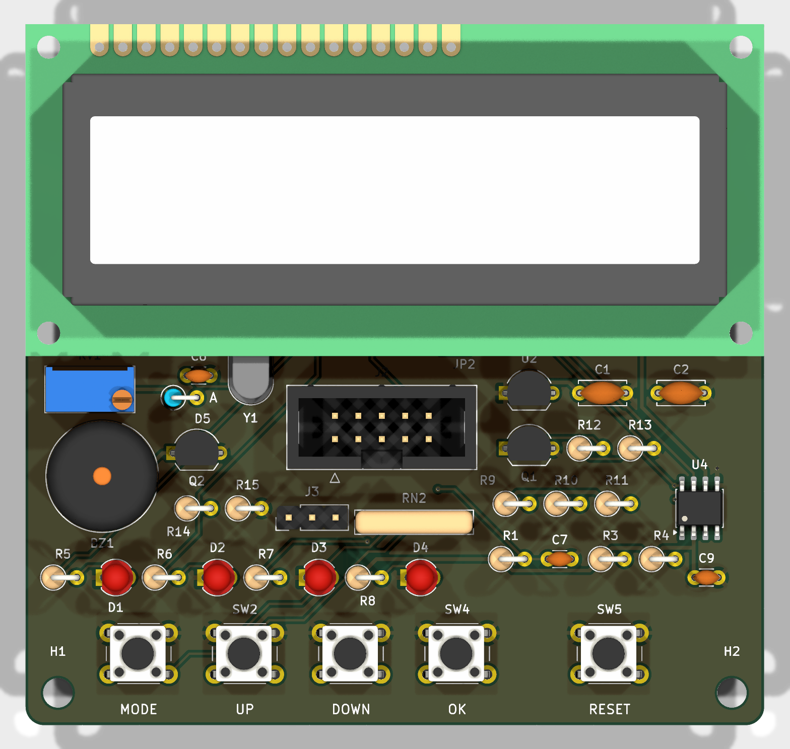

# LPC1114-LCD

Placa de desarrollo sencilla basada en el microcontrolador **NXP LPC1114FN28 (ARM Cortex-M0, DIP-28)**
con pantalla **LCD 1602**, reloj de tiempo real con pila, LEDs, pulsadores y buzzer.
El objetivo final es un **reloj digital con alarma** programado en C.



| Fase | Contenido | Estado |
|------|-----------|--------|
| 1 | Diseño hardware (KiCad 10, PCB de 2 capas para JLCPCB) | Rev 1.0: lista para fabricar |
| 2 | Firmware en C: reloj digital con alarma (+ tests) | Pendiente |

## Características

- **MCU**: LPC1114FN28/102, 50 MHz, 32 kB flash, 4 kB RAM, en zócalo DIP-28.
- **Reloj**: cristal de 12 MHz (base de tiempos precisa) y **RTC DS3231M** (±5 ppm) por I2C, con **pila CR2032** para no perder la hora sin alimentación.
- **Alimentación**: micro USB (5 V), fusible PTC de 500 mA y regulador LDO **MCP1700 de 3,3 V**.
- **USB-serie**: **CH340C** en el mismo conector micro USB. Además, conector UART de 3 pines (GND, RX, TX) a 3,3 V.
- **Programación/depuración**: conector **SWD ARM Cortex de 10 pines a 2,54 mm** (CMSIS-DAP), o bootloader ISP por UART.
  Los jumpers JP1/JP2 permiten que el CH340 controle RESET e ISP automáticamente (`lpc21isp -control`).
- **LCD 1602** en modo 4 bits, montado encima del PCB. El footprint es de 18 pines: 16 pines estándar más 2 para módulos con retroiluminación RGB. Retroiluminación regulable por PWM y contraste ajustable con trimmer.
- **Interfaz de usuario**: 4 pulsadores (MODE/ISP, UP, DOWN, OK), pulsador de RESET, 3 LEDs de usuario más el LED de encendido, y buzzer pasivo con transistor (PWM).
- **PCB**: 80 × 76 mm, 2 capas, casi todo de agujero pasante (THT) para soldar a mano. 4 taladros M2.5 para el LCD y 2 taladros M3 para la caja.

## Estructura del repositorio

```
LPC1114-LCD/
├── hardware/                 Proyecto KiCad 10
│   ├── LPC1114-LCD.kicad_pro/.kicad_sch/.kicad_pcb
│   ├── lib/                  Símbolos y footprints propios (LPC1114FN28, LCD 18 pines, CH340C)
│   ├── fabrication/          Ficheros para JLCPCB (Gerber .zip), BOM y modelo 3D STEP
│   └── scripts/              export_fab.ps1: ERC/DRC y generación de todos los ficheros
├── firmware/                 Fase 2 (en C)
│   ├── app/                  Aplicación (reloj con alarma); inc/board.h = mapa de pines
│   ├── lib/                  CMSIS / drivers
│   └── tests/                Tests unitarios
└── docs/
    ├── datasheets/           Hojas de datos de los componentes
    ├── hardware/             Notas de diseño y esquemático en PDF
    └── images/               Renders del PCB
```

## Mapa de pines (LPC1114FN28)

| Pin | Puerto | Función en la placa | Notas |
|----:|--------|---------------------|-------|
| 1  | PIO0_8  | BTN_OK (SW4)        | Activo en bajo, pull-up de 10k |
| 2  | PIO0_9  | BTN_UP (SW2)        | Activo en bajo |
| 3  | SWCLK   | SWD                 | |
| 4  | PIO0_11 | LCD_BL (PWM CT32B0_MAT3) | Retroiluminación, activo en alto. IOCON FUNC=1 |
| 5  | PIO0_5  | I2C SDA (DS3231M)   | Pull-up de 4k7 |
| 6  | PIO0_6  | LCD D7              | |
| 9  | PIO1_0  | LCD D6              | IOCON FUNC=1 |
| 10 | PIO1_1  | LCD D5              | IOCON FUNC=1 |
| 11 | PIO1_2  | LCD D4              | IOCON FUNC=1 |
| 12 | SWDIO   | SWD                 | |
| 13 | PIO1_4  | LCD E               | |
| 14 | PIO1_5  | LCD RS              | |
| 15 | PIO1_6  | UART RXD            | Desde el CH340 (1k en serie) / J3 pin 2 |
| 16 | PIO1_7  | UART TXD            | Hacia el CH340 / J3 pin 3 |
| 17 | PIO1_8  | BTN_DOWN (SW3)      | Activo en bajo |
| 18 | PIO1_9  | BUZZER (PWM CT16B1_MAT0) | Activo en alto (transistor NPN) |
| 19/20 | XTALOUT/XTALIN | Cristal de 12 MHz | |
| 23 | RESET   | RESET (SW5, SWD, CH340 DTR vía JP1) | |
| 24 | PIO0_1  | BTN_MODE (SW1) / ISP | Pulsado durante el reset: bootloader UART |
| 25 | PIO0_2  | LED1 (rojo)         | Activo en alto |
| 26 | PIO0_3  | LED2 (amarillo)     | Activo en alto |
| 27 | PIO0_4  | I2C SCL (DS3231M)   | Pull-up de 4k7 |
| 28 | PIO0_7  | LED3 (verde)        | Activo en alto |

El LCD tiene R/W a GND (solo escritura). El mismo mapa está en [firmware/app/inc/board.h](firmware/app/inc/board.h).

## Fabricación en JLCPCB

1. Sube [hardware/fabrication/LPC1114-LCD_JLCPCB.zip](hardware/fabrication/LPC1114-LCD_JLCPCB.zip) en <https://jlcpcb.com> (*Order now → Add gerber file*).
2. Opciones: 2 capas, FR-4, 1,6 mm, 1 oz, HASL (con o sin plomo), color a elegir.
   Las dimensiones (80 × 76 mm) se detectan automáticamente.
3. *Remove Order Number* → **Specify a location**: el número de pedido se imprimirá donde pone `JLCJLCJLCJLC`, en la cara inferior.
4. No hace falta montaje (PCBA): los componentes se sueldan a mano. La lista está en
   [hardware/fabrication/LPC1114-LCD_BOM.csv](hardware/fabrication/LPC1114-LCD_BOM.csv).

Para regenerar los ficheros después de modificar el diseño en KiCad:

```powershell
powershell -ExecutionPolicy Bypass -File hardware\scripts\export_fab.ps1
```

## Montaje

Consulta [docs/hardware/design-notes.md](docs/hardware/design-notes.md), que incluye el orden de soldadura, las alturas máximas bajo el LCD,
las cotas de los taladros para la caja y la lista de piezas mecánicas (tira de pines hembra, separadores, zócalo…).

## Programación (fase 2)

- **SWD**: programador CMSIS-DAP en J2 con [pyOCD](https://pyocd.io) (`pyocd flash -t lpc1114fn28 app.hex`) u OpenOCD.
- **UART ISP**: mantén MODE pulsado y pulsa RESET, luego usa `lpc21isp` o Flash Magic por el puerto COM del CH340.
  Con JP1 y JP2 cerrados con estaño, `lpc21isp -control` lo hace automáticamente.

## Licencia

[MIT](LICENSE): hardware, firmware y documentación de este repositorio. Las hojas de datos de `docs/datasheets/` pertenecen a sus fabricantes.
