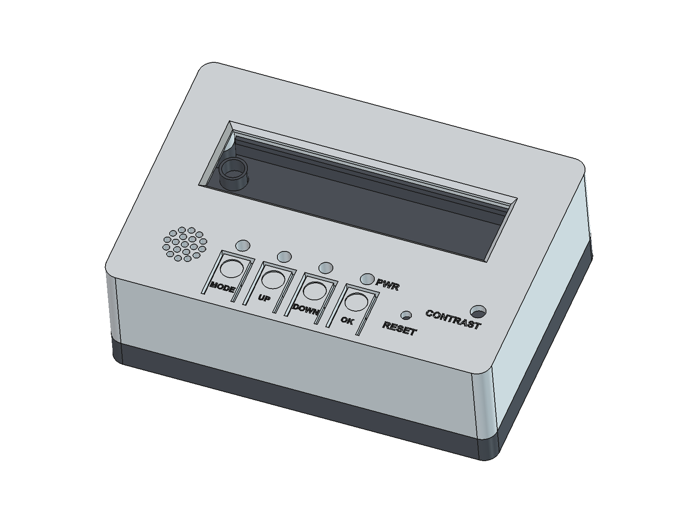
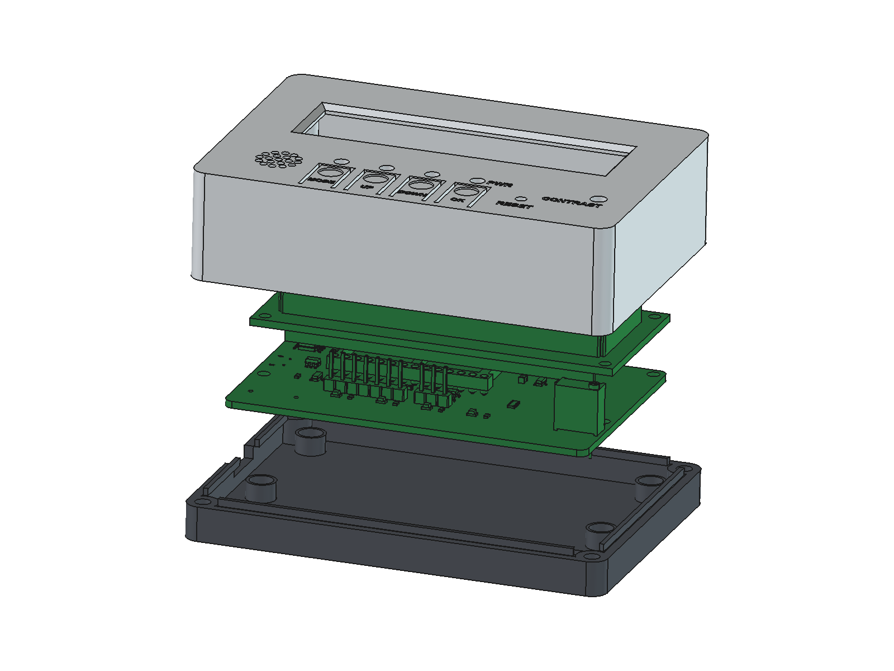
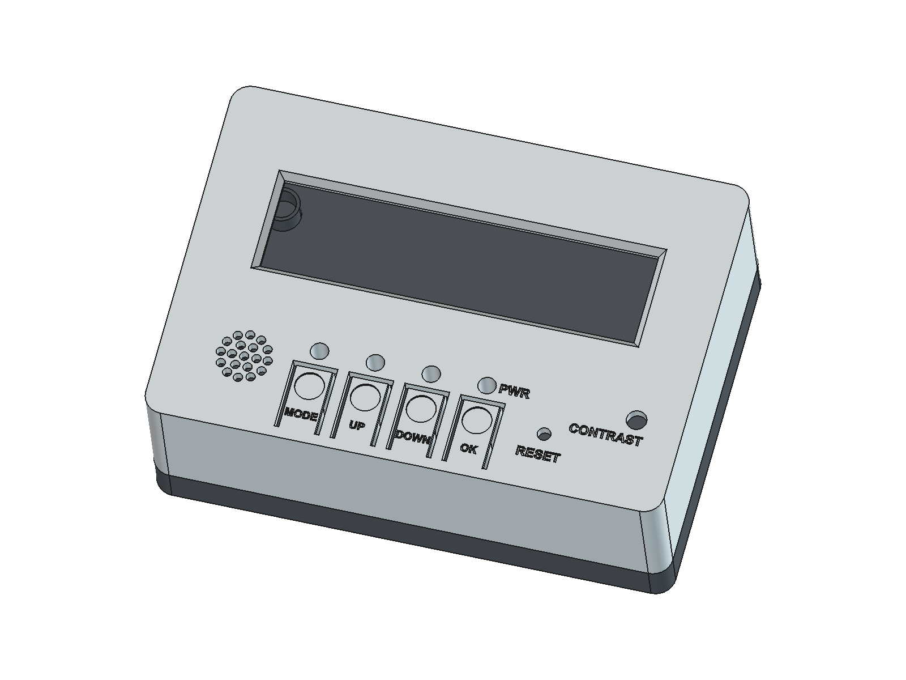
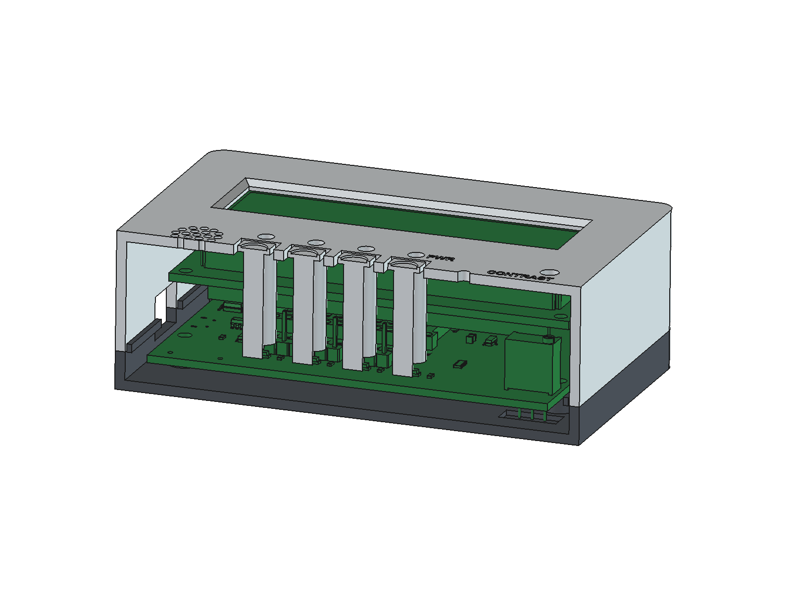
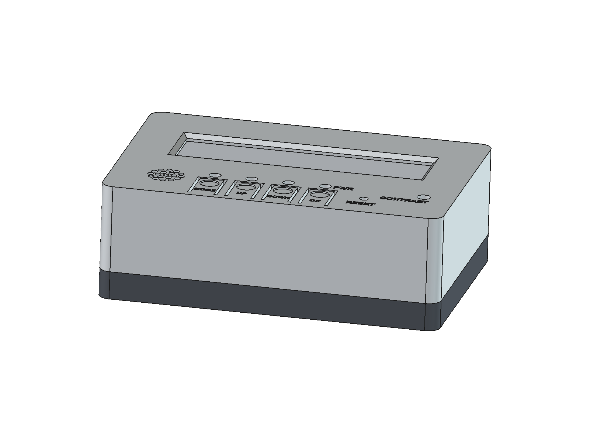

# Caja impresa en 3D

Caja de dos piezas para la placa LPC1114-LCD v1.1: la **superior** (display) y la **inferior** (base).
Se cierra con **4 tornillos M3 × 16** que entran desde abajo.

| Montada | Despiece |
|---------|----------|
|  |  |
|  |  |



## Ficheros

| Fichero | Uso |
|---------|-----|
| `case_top.step`, `case_base.step` | Modelo CAD de cada pieza |
| `case_assembly.step` | Las dos piezas y el PCB con sus componentes (para comprobar ajustes) |
| `case_top.stl`, `case_base.stl` | Para el laminador, ya en la orientación de impresión |
| `LPC1114-LCD_case.FCStd` | Documento de FreeCAD |
| `case.py` | Script paramétrico que genera todo lo anterior |
| `render.py` | Genera las imágenes de `docs/images/case_*.png` |

## Características (v1.1)

- Medidas exteriores: **92,8 × 64,8 × 31,4 mm**. Paredes y fondo de 2 mm; la unión entre piezas está a la altura de la cara superior del PCB.
- **Ventana del LCD** de 67 × 17 mm con chaflán exterior. La tapa apoya sobre el marco del LCD (holgura de 0,2 mm).
- **Pulsadores integrados**: cada lengüeta flexible de la tapa (1,2 mm de grosor) tiene un vástago que baja hasta el
  pulsador SMD TS-1187A (1,5 mm de alto), con 0,4 mm de holgura.
- **Guías de luz** para los 4 LEDs SMD: agujeros de Ø3,2 mm con un tubo que baja hasta 2,2 mm por encima del LED.
  Van con varilla de metacrilato de Ø3 mm y unos 22 mm de largo (desde la superficie de la tapa hasta casi tocar el LED).
- Agujeros para el RESET (se pulsa con un clip) y el ajuste de **contraste** (tornillo del trimmer), rejilla para el buzzer y
  abertura para el **micro USB** en el lateral izquierdo.
- La base tiene 4 tubos bajo los taladros del LCD. En ellos se alojan las cabezas de los tornillos M2.5 que unen el PCB a los separadores del LCD.
  Al cerrar la caja, el PCB queda sujeto entre los tubos de la base y la tapa, que apoya sobre el LCD. Un labio perimetral centra la tapa.
- Comprobado en FreeCAD: **0 mm³ de interferencia** entre las dos piezas y el PCB (con el LCD a su altura real y las tiras J2/J3).
  Los pulsadores SMD, el buzzer y el micro USB no tienen modelo 3D en KiCad, así que los he comprobado con sus medidas.
- J2 (SWD) y J3 (UART) quedan dentro. Para programar por SWD hay que abrir la caja; con ella cerrada se puede programar por el USB (bootloader ISP).

## Impresión (PLA o PETG)

| Pieza | Orientación | Notas |
|-------|-------------|-------|
| Superior | Cara del display apoyada en la cama (el STL ya está girado) | Capa de 0,2 mm, 3 perímetros, relleno del 20 %. No necesita soportes. |
| Base | Fondo apoyado en la cama | Sin soportes. |

## Tornillería y piezas

| Cantidad | Pieza | Uso |
|---------:|-------|-----|
| 4 | Tornillo M3 × 16 (cabeza cilíndrica o alomada, Ø ≤ 6 mm) | Cierre de la caja desde abajo; rosca en el plástico (taladro guía de Ø2,5 mm) |
| 4 | Separador M2.5 de 11 mm hembra-hembra | LCD sobre el PCB |
| 8 | Tornillo M2.5 × 5 (cabeza de Ø ≤ 4,5 mm) | 4 arriba (LCD) y 4 abajo (PCB); las cabezas de abajo quedan dentro de los tubos de la base |
| 4 | Varilla de metacrilato de Ø3 mm y ~22 mm | Guías de luz de los LEDs |

Si prefieres insertos roscados de latón (M3, Ø4 × 5,7 mm), cambia `PILOT_D = 4.0` en `case.py` y regenera los ficheros.

## Montaje

1. Monta el LCD sobre el PCB con los separadores de 11 mm y corta las patillas de la cara inferior a menos de 2,5 mm.
2. Coloca el conjunto en la base: las cabezas de los tornillos M2.5 entran en los 4 tubos.
3. Mete las 4 varillas de luz en la tapa y ciérrala. El labio de la base la centra. Comprueba que los 4 pulsadores hacen clic.
4. Cierra con los 4 tornillos M3 × 16 desde abajo.

## Modificar la caja

Todas las medidas son parámetros al principio de `case.py`: holguras, grosores, altura del LCD (`LCD_STACK`), ventana, etc.
Para regenerar los ficheros STEP, STL y FCStd:

```powershell
& "C:\Program Files\FreeCAD 1.1\bin\freecadcmd.exe" enclosure\case.py
```

Las imágenes se regeneran con `render.py` desde la interfaz de FreeCAD (menú *Macro*) o lanzando `freecad.exe` con el script.
